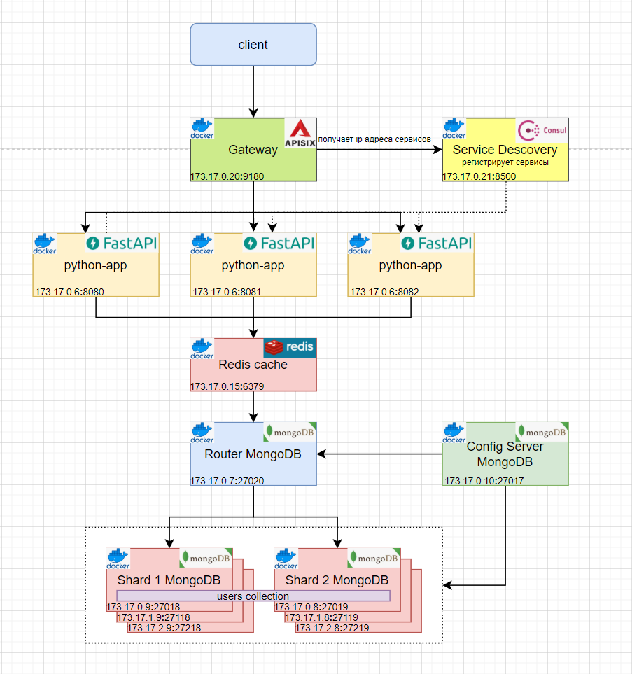

## Горизонтельное масштабирование приложения    

### Описание     
В целях повышения **производительности** применяется горизонтельное масштабирование приложения, используя паттерн service discovery.    
Паттерн service discovery применяет для stateless-приложений, которые не хранят в себе информацию о предыдущих состояниях или взаимодействиях с клиентом, таким образом, 
позволяя их масштабировать. 
Архитектура паттерна содержит API Gateway Apisix, который балансирует и направляет клиентские запросы на ip-адреса сервисов, которые получает от Consul Service Discovery сервиса, который регистрирует приложения и хранит метаинформацию о них.    

    
### Архитектура приложения
   