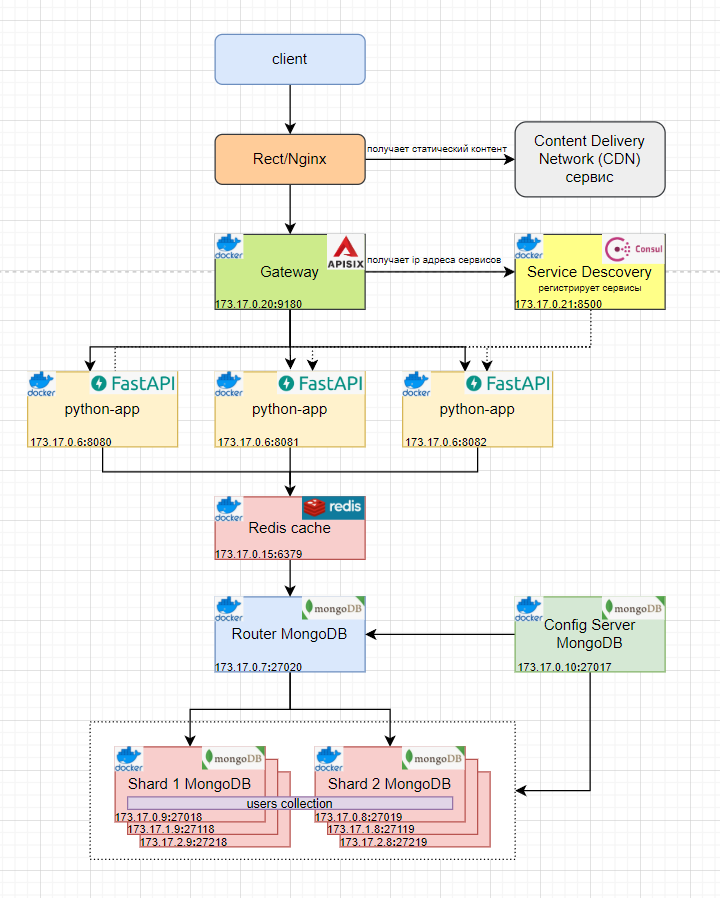

## Масштабирование с использованием Content Delivery Network (CDN) сервисов   

### Описание     
В целях повышения **производительности** и ускорения доставки статического контента применяются Content Delivery Network (CDN) сервисы.    
Content Delivery Network - это распределенные сервисы, которые в ответ на запросы клиента запрошивают, получают и кешируют данные от источника и 
отдают их клиенту. Использование CDN позволяет снизить нагрузку на источник хранения информации и ускоряет ее доставку. 
CDN-серверы позволяют формировать контент в зависимости от месторасположения клиента.

### Архитектура приложения
   
    