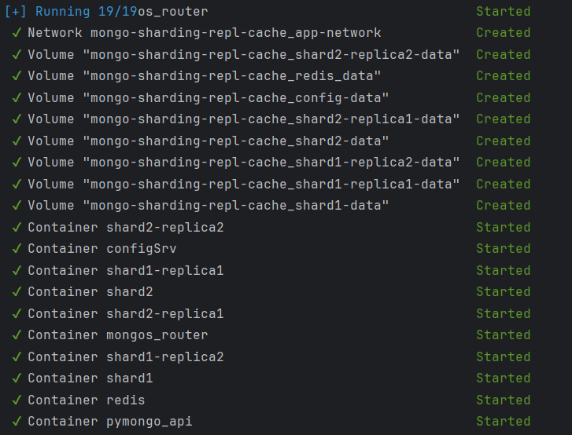
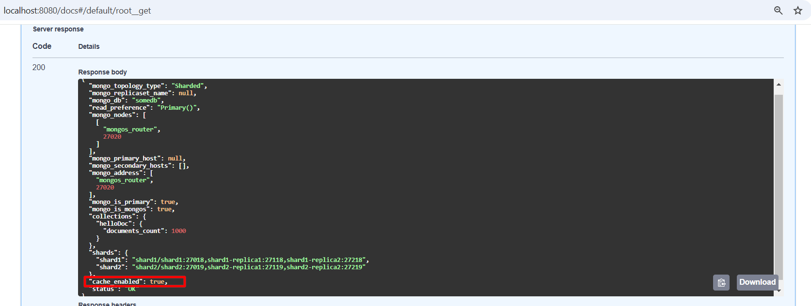
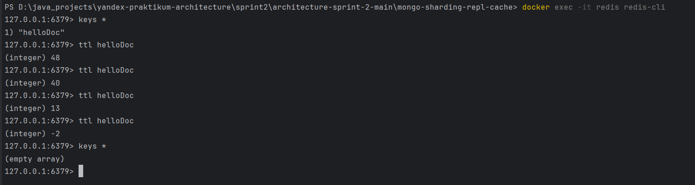
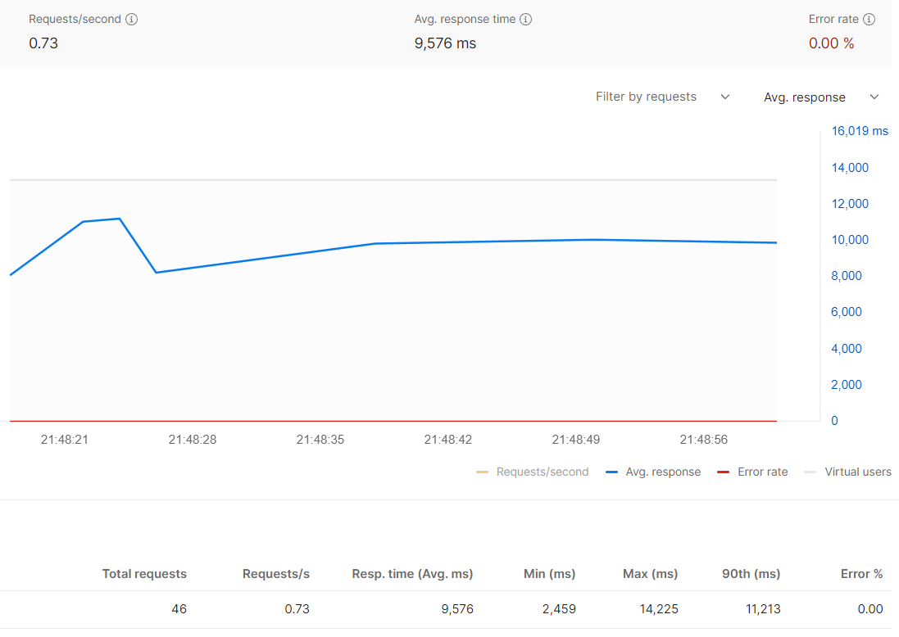
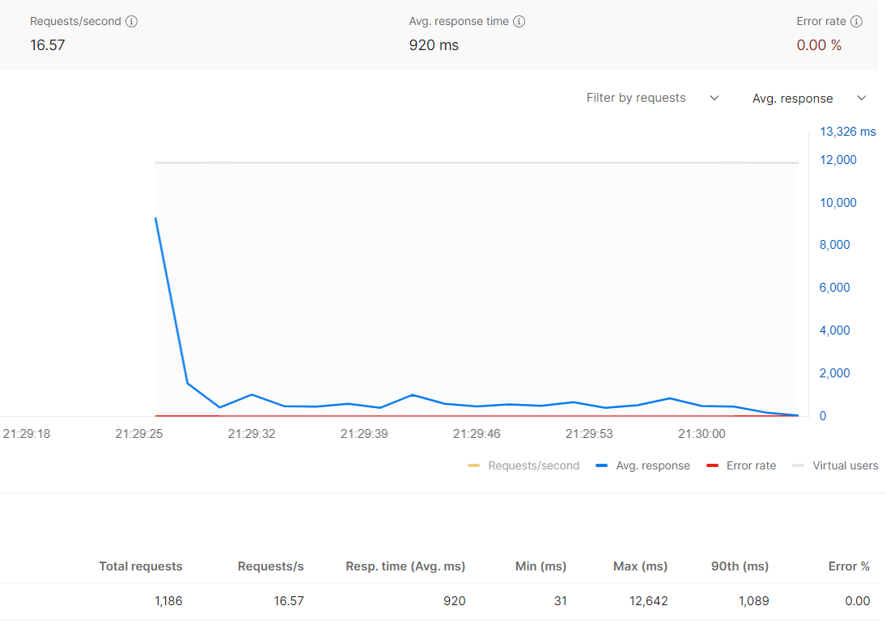
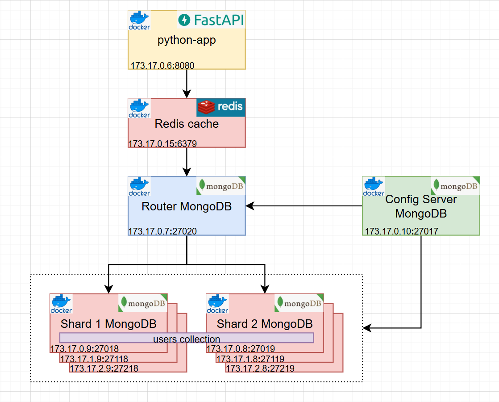

## Кеширование данных 

### Описание проекта    
В целях повышения **производительности при высокой нагрузке на операции чтения редко изменяемых одинаковых данных** применяется кеширование этих данных.  
В проекте в качестве кеша применяется Redis, который хранит данные в оперативной памяти и распологается перед базой MongoDB, что позволяет получить данные быстрее. 
На кеш дополнительно устанавливается время его жизни (time to leave), что позволяет периодически его обновлять. 
Выполненные нагрузочные тесты с метриками производительности показывают эффективность применения кеширования.     

Как запустить?  
Выполнить docker compose up -d в терминале из папки mongo-sharding-repl с файлом compose.yml    
[](./readme/docker-console-run.png)    

Инициализируем сервер конфигурации, шарды, реплики, роутер, задаем метод шардирования и наполняем данными    
```shell
./scripts/mongo-init.sh
```
Приложение доступно на 8080 порту.  

Спецификация openAPI доступна на 8080/docs  
  

Конфигурация mongodb доступна на 8080/    


Очистка кешей по истечении time-to-leave 60сек  
 

### Нагрузочные тесты      
Без кеширования     
   
    
С кешированием      
    
    
### Архитектура приложения
[](./readme/architecture.png)   

### Использованные технологии   
-Python     
-FastAPI Framework   
-MongoDB, Compass   
-Redis  
-Postman    
-Docker     
-Intellij Idea  