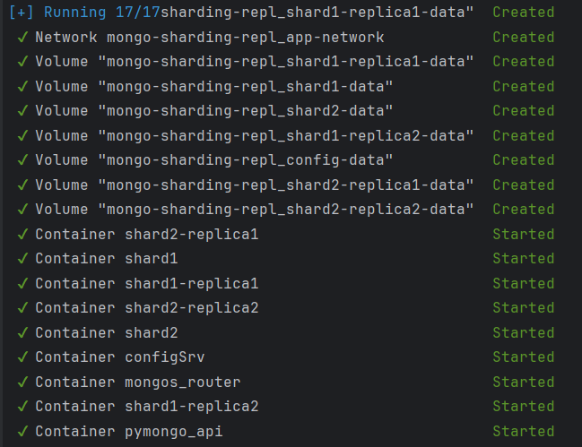
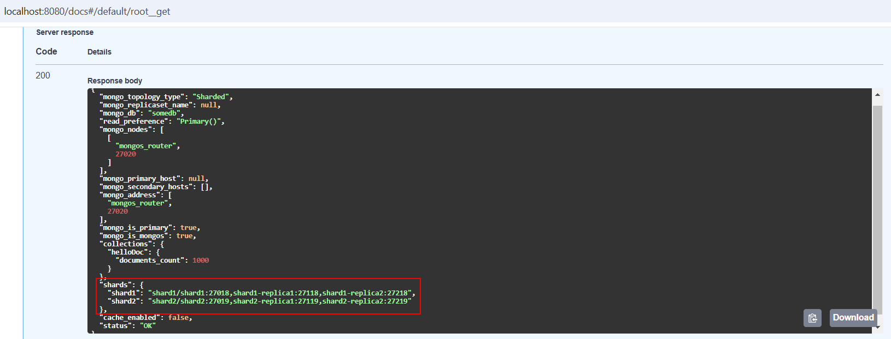
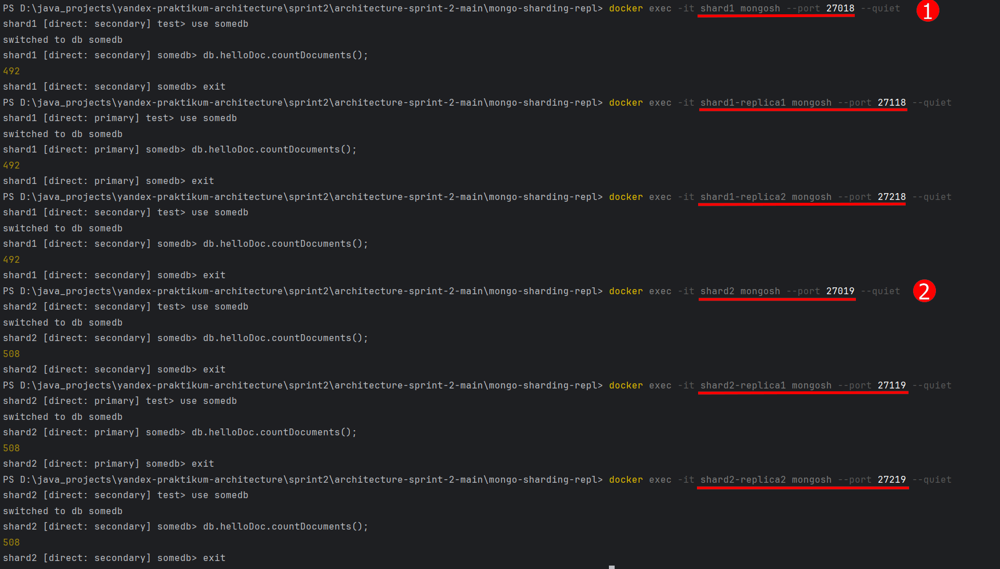
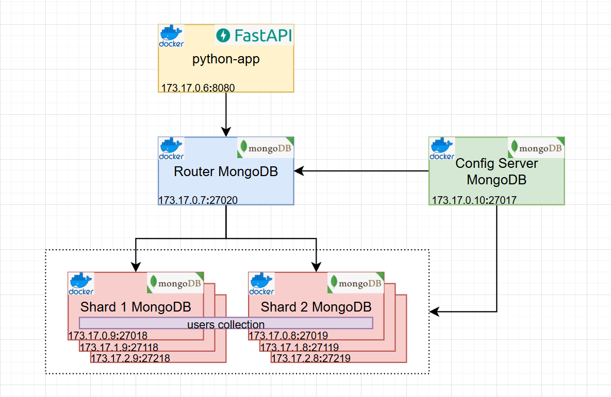

## Репликация базы данных 

### Описание проекта    
В целях повышения **надежности и высокой доступности при высокой нагрузке и в случае, если потеря данных недопустима,** применяется горизонтальное масштабирование методом репликации базы данных.  
Репликация - это дублирование данных на нескольких серверах (master и replica). При выходе из строя одного из серверов  
работа продолжится с копией (репликой) сервера. Существует два типа репликации: master-slave и multi-master.    
В проекте применяется тип  master-slave: главный сервер всегда один. Мастер-сервер обслуживает операции чтения и записи, а 
серверы-реплики - только операции чтения. В случае выхода из строя мастер-сервера реплика-сервер становится мастер-сервером.    

Как запустить?  
Выполнить docker compose up -d в терминале из папки mongo-sharding-repl с файлом compose.yml    
```shell
docker compose up -d
```
[](./readme/docker-console-run.png)    

Инициализируем сервер конфигурации, шарды, реплики, роутер, задаем метод шардирования и наполняем данными    
```shell
./scripts/mongo-init.sh
```
Приложение доступно на 8080 порту.  

Спецификация openAPI доступна на 8080/docs  
  

Конфигурация mongodb доступна на 8080/    


Состояние шардов с репликами      
    

### Архитектура приложения  

[](./readme/architecture.png)   

### Использованные технологии
-Python     
-FastAPI Framework   
-MongoDB, Compass   
-Postman    
-Docker     
-Intellij Idea