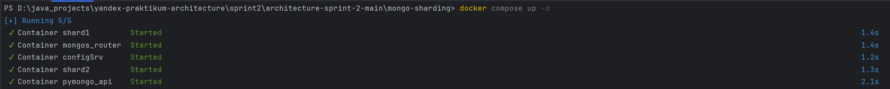
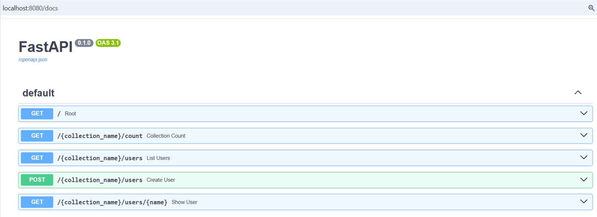
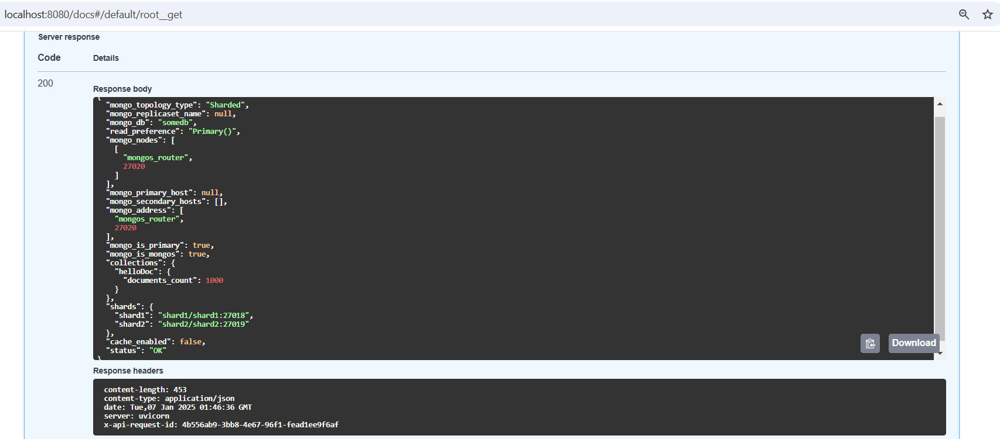
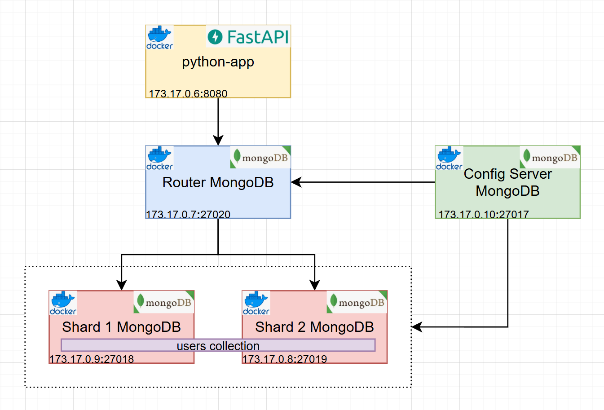

## Шардирование базы данных 

### Описание проекта    
Проект состоит из приложения и nosql базы данных.
В целях повышения производительности применяется горизонтальное масштабирование методом шардирования базы данных.
Коллекция с большим набором данных распределяется по нескольким серверам(шардам), что позволяет распределить нагрузку.  
Метод шардирования выбран хешированным(key based sharding) и настроивается при конфигурации роутера mongodb.  
Шард базы данных для размещения объекта user однозначно определяется через вычисление хеша от его поля name.  

Как запустить?  
Выполнить docker compose up -d в терминале из папки mongo-sharding с файлом compose.yml    
```shell
docker compose up -d
```
[](./readme/docker-console-run.png)    

Инициализируем сервер конфигурации, шарды, роутер, задаем метод шардирования и наполняем данными    
```shell
./scripts/mongo-init.sh
```
Приложение доступно на 8080 порту.

Спецификация openAPI доступна на 8080/docs  
  

Конфигурация mongodb доступна на 8080/    


### Архитектура приложения  

[](./readme/architecture.png)   

### Использованные технологии
-Python     
-FastAPI Framework   
-MongoDB, Compass   
-Postman    
-Docker     
-Intellij Idea